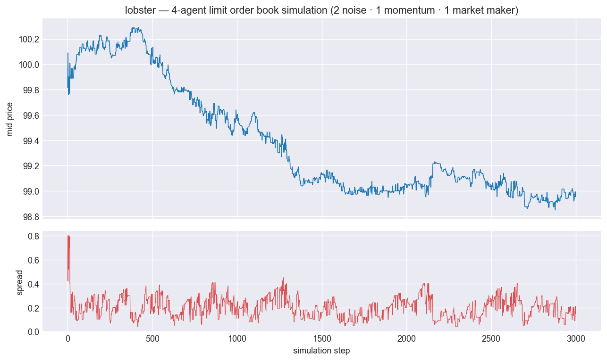

# lobster

[](https://github.com/superkush06/lobster/actions/workflows/ci.yml)
[](https://www.python.org/)
[](LICENSE)

A limit order book microstructure simulator with realistic price-time priority
matching, latency models, market impact, and pluggable agents — plus a
**LOBSTER-format message replay** so you can drive it with real NASDAQ data.



*A 4-agent run (2 noise · 1 momentum · 1 market maker): mid-price path on top,
the resulting bid-ask spread below. Reproduce with `python examples/render_hero.py`.*

## TL;DR

```python
from lobster import OrderBook, Order, Side, OrderType, match

book = OrderBook()
book.add(Order(Side.BUY, qty=100, price=99.5))
book.add(Order(Side.SELL, qty=50, price=100.5))
# Marketable buy sweeps the ask:
trades = match(book, Order(Side.BUY, qty=30, price=None, type=OrderType.MARKET))
print(trades[0].price)  # 100.5
print(book.spread)      # 1.0
```

## Why

The limit order book is the central data structure of every electronic market.
Most interesting questions in market microstructure — queue position, adverse
selection, market-maker P&L, optimal execution — can only be studied with a
realistic simulation. Off-the-shelf LOB packages are either toys (no real
matching) or proprietary trading-firm internals. `lobster` is a clean,
hackable middle ground.

## Features

- **Price-time priority** matching engine with limit, market, partial-fill
  and cancel semantics
- **Latency models**: constant + jittered (gamma) network/processing delays
- **Market-impact models**: linear and Almgren–Chriss-style square-root
- **Pluggable agents**: `NoiseAgent`, `MarketMakerAgent` (inventory-skewed,
  with cancel/replace), `MomentumAgent` (responds to tape imbalance)
- **LOBSTER message replay**: reconstruct the book from real NASDAQ-style
  `add / cancel / delete / execute` message streams (`replay_csv`)
- **Analytics**: spread, depth, queue position, agent P&L, and an
  **adverse-selection markout** metric
- **Deterministic** under a given seed — reproducible simulations
- **Fast**: ~485k inserts/s, ~357k matches/s, ~656k replayed msg/s
  (pure Python; see `benchmarks/throughput.py`)

## Install

```sh
pip install -e ".[dev]"
```

## Quickstart

```sh
python examples/basic_book.py
python examples/market_maker_demo.py
```

## Math

The book exposes `mid`, `spread`, and `depth(side, k)` directly. Trade
arrivals are recorded on a `Tape`; the matching engine emits trades
price-time-priority. Market impact for an order of size $Q$ traded against a
liquidity parameter $\eta$ is modeled as:

- **Linear**: $\Delta p = \eta \cdot Q$
- **Square-root**: $\Delta p = \eta \cdot \sqrt{Q / V}$, where $V$ is
  the recent traded volume (Almgren-Chriss style).

The market-maker quotes around mid with a width that increases linearly in
inventory imbalance to avoid runaway position.

## Layout

```
lobster/
├── order.py       # Side, OrderType, Order
├── book.py        # PriceLevel, OrderBook
├── matching.py    # match() — price-time priority engine
├── tape.py        # Trade dataclass + Tape buffer
├── latency.py     # ConstantLatency, JitteredLatency
├── impact.py      # LinearImpact, SquareRootImpact
├── agents/        # Agent base + Noise/MM/Momentum
├── sim.py         # Simulation event loop
└── analytics.py   # Spread/depth/queue-position/P&L
```

## Design

See [`docs/design.md`](docs/design.md) for modeling assumptions, invariants,
and known limitations.

## Example output

Running `examples/market_maker_demo.py --steps 5000 --seed 7`:

```
Trades:        5068
Spread mean:   0.2789
Spread p95:    0.6500
Agent P&L:
  agent 1 (   noise): cash=-207580.76  inv=+2114  mtm= -1465.76
  agent 2 (   noise): cash=-159881.92  inv=+1638  mtm=  -176.92
  agent 3 (momentum): cash=+366517.41  inv=-3751  mtm=  +794.91
  agent 4 (   maker): cash=  +945.27  inv=   -1  mtm=  +847.77
```

The market maker holds a flat inventory (≈0) and books a steady profit; with
cancel/replace the spread now stays tight (mean ≈ 0.28 vs ≈ 1.43 before).
Quantify the maker's adverse selection with `Analytics.markout(4, horizon=10)`
(negative = the price moves against its fills — the risk the spread pays for).

See [`examples/walkthrough.ipynb`](examples/walkthrough.ipynb) for an
end-to-end notebook (build → simulate → plot → analyze → replay real data).

## Known limitations

- Latency model is applied per-agent but the matching engine itself is
  synchronous (no queue arbitration at sub-tick resolution).
- Replay reconstructs the *visible* book only; LOBSTER hidden-order executions
  (type 5) are intentionally skipped.
- Greeks/risk are intentionally out of scope — see `optune` for those.

## License


MIT — see [LICENSE](LICENSE).
