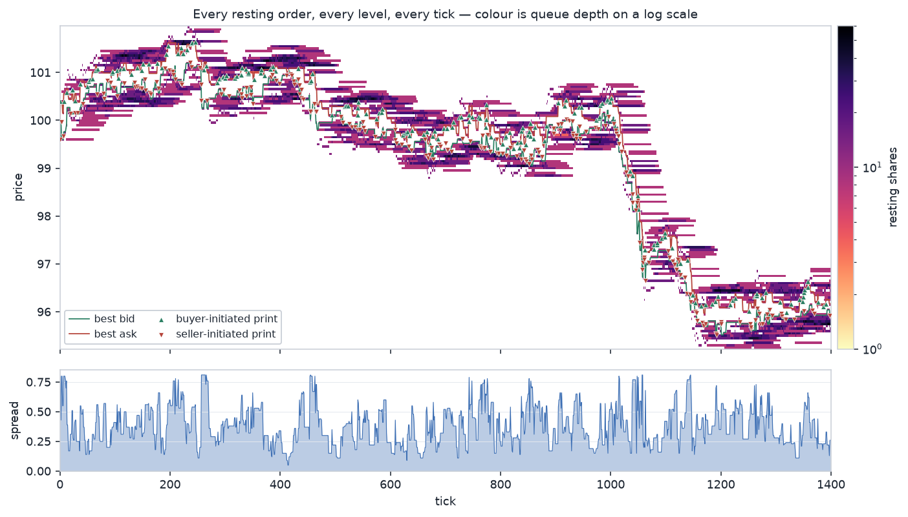
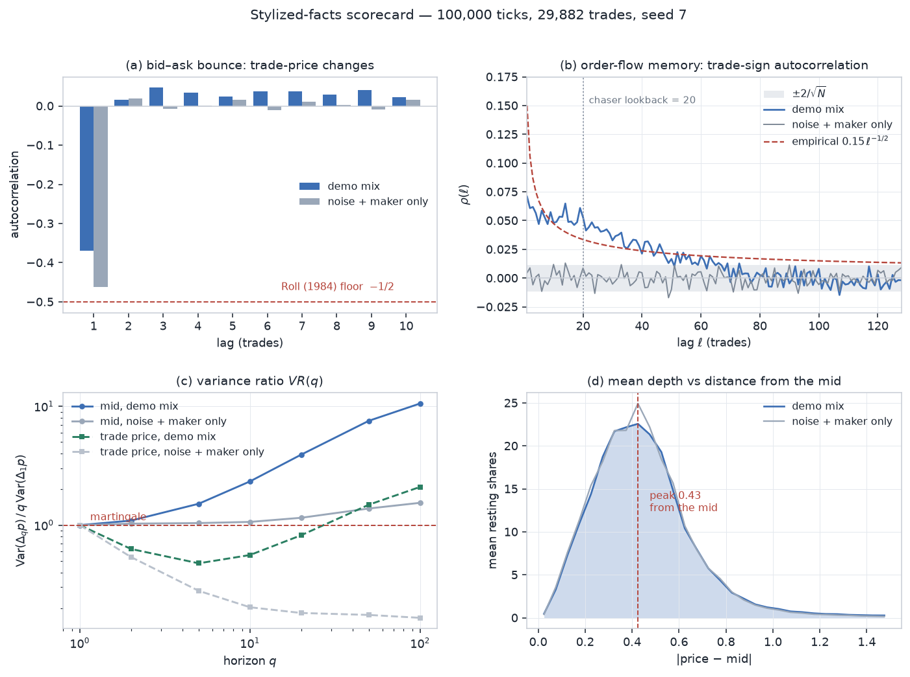
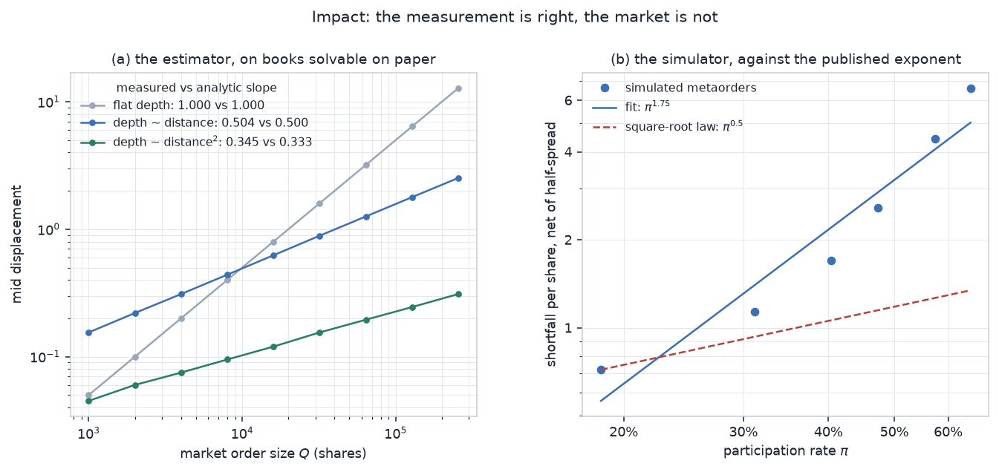
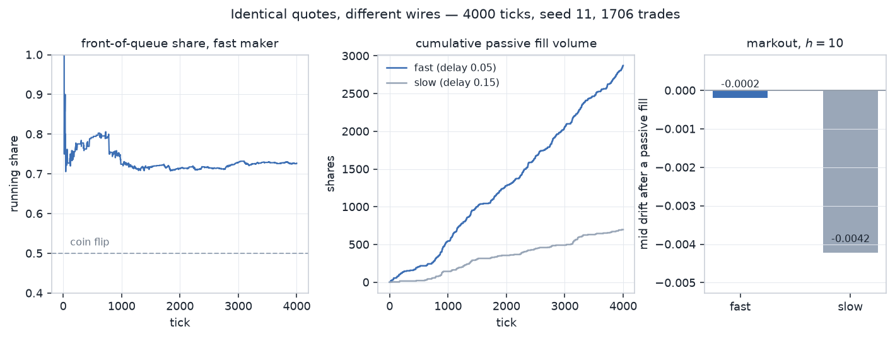

# lobster

[](https://github.com/superkush06/lobster/actions/workflows/ci.yml)
[](https://www.python.org/)
[](LICENSE)

A detailed record of experiments and visualisations on a simulated stock
exchange, with the engine that produced them.

### ▶ Run it in your browser: [**superkush06.github.io/lobster/demo**](https://superkush06.github.io/lobster/demo/)

A live order book you can change, and five experiments measured on it:

| | | |
|---|---|---|
| **00** | Live market | change who is trading and watch the book reshape |
| **01** | The queue | what latency buys, and what it does not |
| **02** | Impact | dial the latent liquidity and watch the cost exponent move |
| **03** | The tape | fat tails and volatility clustering |
| **04** | The book | what a trade costs against resting depth, instantly |
| **05** | Replay | rebuild a book from a NASDAQ-format message feed |

Nothing there is precomputed. The page runs this package under Pyodide, so
every figure is the library answering in your tab, with no server and no
reimplementation.

`lobster` is a limit order book simulator: a price-time-priority matching
engine, agents that quote and take, and a wire between them that has
latency. It is about 2,130 lines of dependency-free Python and 2,870 lines
of tests (214 of them). Every number printed on this page is regenerated and
diffed by `tests/test_readme_examples.py`, so the page cannot drift from the
code.

The hard part is not the data structure. Orders arrive in a different order
than they were sent, a marketable order must never rest and cross the book,
agents can trade with themselves and inflate the tape, and every number you
care about (queue position, adverse selection, market-maker P&L) is
measured off that tape. This package handles those cases and then measures
its own output against published microstructure facts, so you can see where
it stops looking like a real market.



Each horizontal band is a resting queue; colour is the size waiting in it.
The two lines are the best bid and ask, and the triangles are prints:
buyer-initiated above, seller-initiated below. The price does not glide: it
sits inside a corridor of depth until something eats through a level.
Between ticks 1000 and 1150 the bid queues stop being replaced and the whole
structure steps down four points. Regenerate with
`python examples/make_figures.py depth`.

## Install

```sh
pip install -e ".[dev]"         # library + pytest + ruff
pip install -e ".[dev,plot]"    # adds matplotlib, needed for the figures
```

Runtime dependencies: none. The package imports only the standard library.
`matplotlib` (the `plot` extra) is needed only by
`examples/make_figures.py` and the notebook. Run every command below from
the repository root; the examples read relative paths such as
`data/sample_messages.csv`.

## Thirty seconds

```python
from lobster import OrderBook, Order, Side, OrderType, match

book = OrderBook()
book.add(Order(Side.BUY, qty=100, price=99.5))
book.add(Order(Side.SELL, qty=50, price=100.5))

trades = match(book, Order(Side.BUY, qty=30, type=OrderType.MARKET))
print(trades[0].price)   # 100.5
print(book.spread)       # 1.0
```

The API enforces two rules. `book.add()` raises `ValueError` on an order
that would cross the opposite side, because a silently crossed book corrupts
every statistic downstream, so marketable orders go through `match()`. And
`match()` leaves the unfilled remainder on the taker, so `taker.qty > 0`
after a market order means the book ran out of size.

## Running a market

```sh
python examples/basic_book.py           # the data structure, printed
python examples/market_maker_demo.py    # four agents, P&L attribution
python examples/latency_race.py         # two makers, different wires
python examples/scorecard.py            # is the output realistic?
python examples/validate.py             # does it agree with the literature?
python examples/execution_costs.py      # what the book charges a portfolio
```

`market_maker_demo.py --steps 5000 --seed 7` (those are also the defaults):

```
Trades:        1524
Spread mean:   0.3554
Spread p95:    0.6600
Agent P&L:
  agent 1 (   noise): cash=-23789.25  inv= +249  mtm=  -881.25
  agent 2 (   noise): cash=+14971.02  inv= -155  mtm=  +711.02
  agent 3 (momentum): cash= +9232.01  inv= -100  mtm=   +32.01
  agent 4 (   maker): cash=  -413.78  inv=   +6  mtm=  +138.22
```

The maker ends near flat (+6 inventory) and slightly up (+138.22
mark-to-market): it earned the spread and paid for it in inventory risk.
`Analytics.markout(4, horizon=10)` measures the second half of that
trade-off. A negative markout means the mid moves against its fills, which
is the adverse selection the spread is charging for.

## Does the output look like a market?

The package measures this rather than asserting it. `lobster.stylized`
computes four textbook microstructure diagnostics from a finished run, and
`examples/scorecard.py` grades them (about 13 seconds).



```
Stylized-facts scorecard: 100,000 ticks, seed 7

demo mix  (80,706 trades)
     yes  bid-ask bounce             rho1 = -0.245 against Roll's floor of -0.5
     yes  humped depth profile       peak 1.28 from the mid; the touch holds 5.2% of peak size
  partly  long memory of order flow  rho1 = +0.623, gone by lag 89, gamma = 1.29 (real flow: gamma ~ 0.5, never gone)
      no  mid is a martingale        VR(100) = 0.45; 1.0 is a random walk

no chaser  (61,212 trades)
     yes  bid-ask bounce             rho1 = -0.253 against Roll's floor of -0.5
     yes  humped depth profile       peak 1.28 from the mid; the touch holds 5.4% of peak size
     yes  long memory of order flow  rho1 = +0.527, gone by lag 128, gamma = 0.52 (real flow: gamma ~ 0.5, never gone)
      no  mid is a martingale        VR(100) = 0.43; 1.0 is a random walk
```

Panel by panel:

**(a) The bounce is right.** Consecutive trade prices alternate between bid
and ask, so trade-price changes have autocorrelation -0.245 against Roll's
theoretical floor of -1/2. Feed the same covariance into Roll's
implied-spread estimator and it returns 0.1152; the book's actual mean
spread at the ticks where trades printed was 0.2117. The estimator recovers
roughly half the spread that was paid, because a chunk of the quoted spread
here is never crossed. `scorecard.py` prints both.

**(b) Order-flow memory has the right shape and the wrong length.** Without
the chaser, trade signs decay with an exponent of 0.52, against the 0.5 that
Bouchaud et al. report. That comes from the value trader's ladder being
eaten rung by rung, which is a split parent order by another name and is
exactly the mechanism Lillo, Mike and Farmer identify. The horizon is still
far too short: memory is gone by lag 128 where real flow stays positive for
thousands of trades. Add the chaser and its 20-trade window imposes its own
timescale, pushing the exponent to 1.29.

**(c) The mid is still not a martingale, though it fails the other way now.**
VR(100) is 0.45 with the chaser and 0.43 without. Both are sub-diffusive:
the value trader pulls price back toward its fundamental, so returns mean
revert. An earlier version of this package had no such agent and scored 10.6,
badly super-diffusive. Neither version has the balance right.

**(d) The depth profile is humped**, peaking 1.28 from the mid while the
mean half-spread is only 0.096; the innermost bin holds about 5% of the
peak's size. Both agent mixes give the same curve, and that is the tell: the
hump's location is set by the quoting kernel and by the value ladder's
slope, not by adverse selection. The shape is right for a mechanical reason.

Three of four pass without the chaser, two with it. Use this for
queue-position, liquidity-provision and execution-cost questions. The price
process is the weak part: it mean reverts harder than a real one.

## Does it agree with anything outside itself?

The scorecard grades the simulator against four facts it measures itself.
[`docs/validation.md`](docs/validation.md) is the harder test: every number
in it has an answer that was fixed before this library saw it, either a
closed-form identity or a magnitude somebody else published.
`examples/validate.py` produces all of them in about 25 seconds, and the doc
pastes that output verbatim.

The estimators are checked first. If they are wrong, everything measured
with them is wrong too.



| check | ours | reference |
|---|---|---|
| Roll's implied spread on a process built with a spread of 0.10 | 0.09987 | 0.10000 |
| sampling s.d. of VR(2) over 1,500 random walks | 0.0224 | 0.0224 (Lo–MacKinlay) |
| book-walk exponent on a book built to have a square-root law | 0.5038 | 0.5000 |
| `SquareRootImpact`: impact(4Q)/impact(Q) | 2.000000000000 | 2 |

Then the simulator itself, against the literature. It gets the bid-ask
bounce, the humped depth profile, adverse selection, heavy tails, a tail
index inside Cont's band, volatility clustering, and metaorder cost that is
**concave** in size at a fitted exponent of 0.57, against published estimates
of 0.5 to 0.6.

That last one used to be the headline failure: cost came out convex, fitted
between 1.2 and 1.5, which is the wrong sign of curvature. `validation.md`
diagnosed it as an agent set in which nothing replenished liquidity in
response to being consumed, and named the missing piece. `ValueAgent` is that
piece, and the section
[The row that used to fail, and what fixed it](docs/validation.md) shows the
mechanism, the calibration, and what else moved when it landed.

Two rows still miss. Order-flow memory is gone by lag 128 where real flow
lasts thousands of trades, and returns carry a small negative
autocorrelation, -0.058, where the reference is zero.

## Where this sits

This is the microstructure end of a small stack. `portopt` decides what to
hold (Markowitz, Black–Litterman, risk parity); `risk` decides how badly
that can go (VaR, expected shortfall, stress scenarios). Neither knows what
it costs to get from the book you have to the one they asked for. The usual
stand-in is a flat number of basis points, which is linear in size, so it
can never tell you to trade only part of the way.

`examples/execution_costs.py` is the join. It calibrates `cost = k *
participation^delta` off simulated metaorders, then hands that curve to a
three-asset mean-variance problem inlined in the same file (nothing is
imported from the sibling repos; the upstream inputs are written out):

```
  cost per share = 0.437 * participation^1.39, fitted over 18%-63% participation

    fraction moved   utility gain      cost        net
                0%        0.0000%   0.0000%    0.0000%
               20%        0.0193%   0.0003%    0.0190%
               40%        0.0342%   0.0013%    0.0329%
               60%        0.0449%   0.0035%    0.0415%
               80%        0.0514%   0.0069%    0.0445%
              100%        0.0535%   0.0118%    0.0417%

  best move: 80% of the way to target, net +0.0445% of NAV against +0.0535% if trading were free
```

The optimiser wanted the whole move; at this fund size the whole move
destroys value. The stopping point, 30%, comes from the cost curve, and you
only get that curve from a model of the book.

## Latency buys queue position

Two market makers quote identical prices off the same mid. The only
difference is the wire: a constant 0.05 against 0.15 time units of
submission delay. Price-time priority does the rest.



`latency_race.py --steps 4000 --seed 11` (also the defaults):

```
Latency race: identical makers, fast delay=0.05 vs slow delay=0.15
steps=4000  seed=11  trades=1706
  fast maker: front-of-queue share=72.7%  passive fill volume=  2872  markout(h=10)=-0.00019
  slow maker: front-of-queue share=27.3%  passive fill volume=   698  markout(h=10)=-0.00422
```

Three times the speed holds the front of the queue 73% of the time and
captures four times the passive volume. The third panel is the more
interesting result: the slow maker's markout is -0.00422 against the fast
maker's -0.00019, about twenty times worse. The slow maker mostly fills once
the queue ahead of it has already been consumed, which is exactly when being
filled is bad news. Speed buys better volume, not just more of it.

`ConstantLatency(0)` is bit-identical to running with no latency model at
all (`tests/test_event_queue.py` checks this), so the event queue is a
strict superset of the synchronous loop rather than a replacement for it.

## Replaying the LOBSTER message format

No real market data ships with this repository and none was used to validate
it. `data/sample_messages.csv` is a **7-row synthetic fixture** written by
hand in the LOBSTER message format (`Time, EventType, OrderID, Size, Price,
Direction`), and it exists to exercise the parser and the book-reconstruction
path, rather than to stand in for a NASDAQ capture. What this package replays is the
*format*; what it reproduces of real markets is the stylized-facts scorecard
above, which is measured against published microstructure results, not
against a data feed.

```python
from lobster import OrderBook, ReplayStats, replay_csv

# Seed the opening book from the companion orderbook file's first row...
book = OrderBook.from_snapshot(bids=[(99.4, 200)], asks=[(100.6, 150)])
stats = ReplayStats()
book = replay_csv("data/sample_messages.csv", price_scale=1e-4,
                  book=book, stats=stats)
print(book.snapshot(levels=2))
print(f"applied={stats.applied} unknown={stats.unknown_total} clean={stats.clean}")
```

```
{'bids': [(99.5, 60), (99.4, 200)], 'asks': [(100.0, 80), (100.5, 20)], 'mid': 99.75, 'spread': 0.5, 'microprice': 99.71428571428571}
applied=7 unknown=0 clean=True
```

Real LOBSTER message files, the ones you would supply yourself from
lobsterdata.com or any venue that exports the same six columns, reference
orders that were already resting when the capture window opened, which the
fixture above deliberately does not. A cold-start replay cannot match those
ids, so it
counts them instead of dropping them silently: they land in
`stats.unknown_*`, `stats.clean` tells you whether the reconstruction is
faithful, and `strict=True` raises on the first one. Seed the book with
`OrderBook.from_snapshot` and the counters go to zero.

## What's in the box

```
lobster/
├── order.py       # Side, OrderType, Order (with optional ttl)
├── book.py        # PriceLevel, OrderBook (+ from_snapshot)
├── matching.py    # match(): price-time priority engine + STP policies
├── tape.py        # Trade dataclass + Tape buffer
├── latency.py     # ConstantLatency, JitteredLatency (gamma)
├── impact.py      # LinearImpact, SquareRootImpact: pre-trade estimators
├── agents/        # latency-aware Agent base + Noise / MarketMaker / Momentum
├── sim.py         # event-driven arrivals, self-trade prevention, TTL expiry
├── replay.py      # LOBSTER message replay + ReplayStats
├── analytics.py   # spread, depth, queue position, P&L, markout, wash fraction
├── stylized.py    # bounce, flow memory, variance ratios, return distribution
└── execution.py   # read-only book walk, metaorder shortfall, power-law fit
```

Two pieces of exchange hygiene are on by default, because leaving them off
quietly corrupts everything else. `Simulation(stp="cancel_resting")` cancels
an agent's own resting quote instead of printing a wash trade: rerun the
demo above with `stp=None` and 44% of the tape is agents trading with
themselves, and that is exactly the tape `MomentumAgent` and `markout` read.
`Order.ttl` expires stale passive quotes, so a long run no longer ends with
an unboundedly thick book. `Analytics.wash_trade_fraction()` audits the
first; under the default policy it is 0.

All three hot paths (resting a limit order, crossing a marketable one,
replaying a message) run at a few hundred thousand operations per second on
one CPython core. The exact figures move by more than half between machines
and between runs, so rather than quote mine, run
`python benchmarks/throughput.py` and read yours.

## Reading further

- [`docs/theory.md`](docs/theory.md) is the derivations. Queue position and
  fill probability, why latency buys time priority, Roll's bounce and the
  implied-spread estimator, variance ratios, why order-flow memory is a
  consequence of order splitting, Glosten–Milgrom and markout, and why
  linear impact is not the square-root law.
- [`docs/validation.md`](docs/validation.md) is the ledger. What the
  estimators recover from processes with known answers, what the simulator
  reproduces of the published stylized facts, and the four things it gets
  wrong with the reason for each.
- [`docs/design.md`](docs/design.md) covers modelling assumptions, invariants,
  numerics, replay fidelity.
- [`examples/walkthrough.ipynb`](examples/walkthrough.ipynb) will build,
  simulate, plot, analyse, replay, end to end. Needs the `plot` extra and a
  Jupyter install; run it from the `examples/` directory, since it reads
  `../data/sample_messages.csv`.

## What this is not

- **Not a backtester.** There is no historical feed, no portfolio
  accounting, no fill simulation against a recorded tape. `portopt` and
  `risk` sit on the other side of that line; this repository only prices the
  trip between them.
- **Not a data vendor.** The only file under `data/` is the 7-row synthetic
  LOBSTER-format fixture described above. Bring your own capture.
- **Not a trading system.** No venue connectivity, no order gateway, no
  risk controls. Nothing here should touch a live account.
- **Not optimised.** Pure standard-library Python, no NumPy, no pandas, no
  extension modules. The constraint is deliberate, and it is what keeps the
  matching engine and the estimators readable end to end, and it is why the
  README quotes correctness numbers and not throughput numbers.

## Known limitations

- **No informed traders and no parent orders.** Both show up directly in the
  scorecard above: nothing anchors the price, and order-flow memory dies
  with the momentum agent's lookback.
- **No tick size.** Prices are floats rounded to two decimals at agent
  boundaries. Queue dynamics at the touch depend heavily on the tick in real
  venues.
- **Only submissions pay latency.** Cancels are instantaneous, so the
  cancel-race (pulling a stale quote before it is picked off) is not
  modelled, which flatters fast agents.
- **Replay reconstructs the visible book only.** Hidden-order executions
  (LOBSTER type 5) and auction crosses are skipped by design, and snapshot
  seeding fixes opening depth without giving pre-window orders individual
  ids.
- **The price mean reverts too hard.** `VR(100)` is about 0.44 where a
  random walk is 1.0, because the value trader pulls price back toward its
  fundamental. Metaorder impact is measured net of that fundamental's own
  drift (pass `reference=` to `execute_metaorder`); measure it without the
  control and a drifting value gets billed as impact.
- **One symbol per `Simulation`**, greedy partial fills, no pro-rata
  allocation, no fees.

## License

MIT. See [LICENSE](LICENSE).
