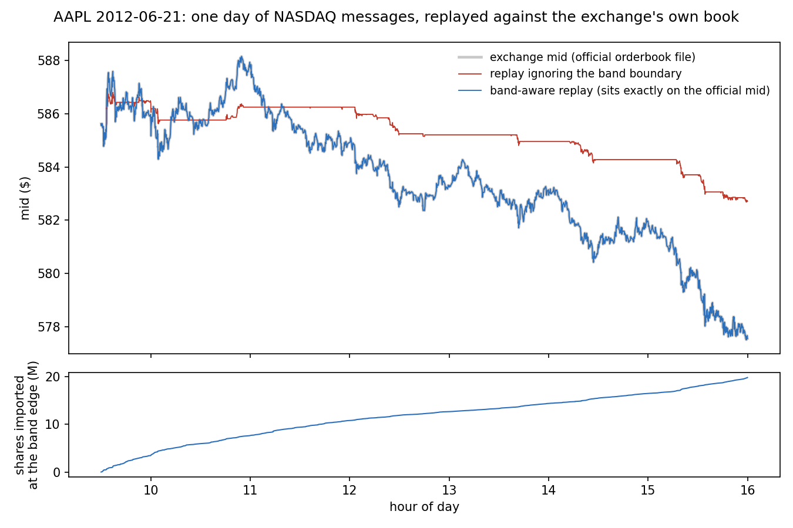

# lobster

[](https://github.com/superkush06/lobster/actions/workflows/ci.yml)
[](https://www.python.org/)
[](LICENSE)

A detailed record of experiments and visualisations on a simulated stock
exchange, with the engine that produced them.

### ▶ Run it in your browser: [**superkush06.github.io/lobster/demo**](https://superkush06.github.io/lobster/demo/)

A live order book you can change, and five experiments measured on it:

| | | |
|---|---|---|
| **00** | Live market | change who is trading and watch the book reshape |
| **01** | The queue | what latency buys, and what it doesn't |
| **02** | Impact | dial the latent liquidity and watch the cost exponent move |
| **03** | The tape | fat tails and volatility clustering |
| **04** | The book | what a trade costs against resting depth, instantly |
| **05** | Replay | rebuild a book from a NASDAQ-format message feed |

Nothing there is precomputed. The page runs this package under Pyodide, so
every figure is the library answering in your tab, with no server and no
reimplementation.

`lobster` is a limit order book simulator: a price-time-priority matching
engine, agents that quote and take, and a wire between them that has
latency. It's about 2,234 lines of dependency-free Python and 3,294 lines
of tests (245 of them). Every number printed on this page is regenerated and
diffed by `tests/test_readme_examples.py`, so the page can't drift from the
code.

The hard part isn't the data structure. Orders arrive in a different order
than they were sent, a marketable order must never rest and cross the book,
agents can trade with themselves and inflate the tape, and every number you
care about (queue position, adverse selection, market-maker P&L) is
measured off that tape. This package handles those cases and then measures
its own output against published microstructure facts, so you can see where
it stops looking like a real market.

<picture>
  <source media="(prefers-color-scheme: dark)" srcset="docs/book_depth_anim_dark.svg">
  
</picture>

Each horizontal band is a resting queue; colour is the size waiting in it.
The two lines are the best bid and ask, and the triangles are prints:
buyer-initiated above, seller-initiated below. The price doesn't glide: it
sits inside a corridor of depth until something eats through a level. Over
ticks 1002 to 1202 the bid queues stop being replaced and the mid falls
4.45.

The head sweeping across is the simulation clock, and the book is uncovered
behind it, so you watch the corridor build rather than arrive finished. The
two dots riding the head are the best bid and ask at that instant. The sweep
takes 8.6 seconds and the loop then holds for 2.4 so the finished frame
reads as a still. It's an SVG, animated with SMIL and no script, which is
all GitHub will run.

Regenerate with `python examples/make_figures.py depth` for the static
[`docs/book_depth.png`](docs/book_depth.png) and
`python examples/make_animated_depth.py` for the animation. Both come off
the same seed, so they are the same 1,400 ticks.

## Install

```sh
pip install -e ".[dev]"         # library + pytest + ruff
pip install -e ".[dev,plot]"    # adds matplotlib, needed for the figures
```

Runtime dependencies: none. The package imports only the standard library.
`matplotlib` (the `plot` extra) is needed only by the two figure scripts,
`examples/make_figures.py` and `examples/make_animated_depth.py`, and by the
notebook. The animated figure is hand-emitted SVG and draws nothing through
matplotlib, but it imports the shared simulation config out of
`make_figures`, so it inherits the dependency. Run every command below from
the repository root; the examples read relative paths such as
`data/sample_messages.csv`.

## Thirty seconds

```python
from lobster import OrderBook, Order, Side, OrderType, match

book = OrderBook()
book.add(Order(Side.BUY, qty=100, price=99.5))
book.add(Order(Side.SELL, qty=50, price=100.5))

trades = match(book, Order(Side.BUY, qty=30, type=OrderType.MARKET))
print(trades[0].price)   # 100.5
print(book.spread)       # 1.0
```

The API enforces two rules. `book.add()` raises `ValueError` on an order
that would cross the opposite side, because a silently crossed book corrupts
every statistic downstream, so marketable orders go through `match()`. And
`match()` leaves the unfilled remainder on the taker, so `taker.qty > 0`
after a market order means the book ran out of size.

## Running a market

```sh
python examples/basic_book.py           # the data structure, printed
python examples/market_maker_demo.py    # four agents, P&L attribution
python examples/latency_race.py         # two makers, different wires
python examples/scorecard.py            # is the output realistic?
python examples/validate.py             # does it agree with the literature?
python examples/execution_costs.py      # what the book charges a portfolio
```

`market_maker_demo.py --steps 5000 --seed 7` (those are also the defaults):

```
Trades:        1524
Spread mean:   0.3554
Spread p95:    0.6600
Agent P&L:
  agent 1 (   noise): cash=-23789.25  inv= +249  mtm=  -881.25
  agent 2 (   noise): cash=+14971.02  inv= -155  mtm=  +711.02
  agent 3 (momentum): cash= +9232.01  inv= -100  mtm=   +32.01
  agent 4 (   maker): cash=  -413.78  inv=   +6  mtm=  +138.22
```

The maker ends near flat (+6 inventory) and slightly up (+138.22
mark-to-market): it earned the spread and paid for it in inventory risk.
`Analytics.markout(4, horizon=10)` measures the second half of that
trade-off. A negative markout means the mid moves against its fills, which
is the adverse selection the spread is charging for.

## Does the output look like a market?

The package measures this rather than asserting it. `lobster.stylized`
computes four textbook microstructure diagnostics from a finished run, and
`examples/scorecard.py` grades them (about 13 seconds).


```
Stylized-facts scorecard: 100,000 ticks, seed 7

demo mix  (80,706 trades)
     yes  bid-ask bounce             rho1 = -0.245 against Roll's floor of -0.5
     yes  humped depth profile       peak 1.28 from the mid; the touch holds 5.2% of peak size
  partly  long memory of order flow  rho1 = +0.623, gone by lag 89, gamma = 1.29 (real flow: gamma ~ 0.5, never gone)
      no  mid is a martingale        VR(100) = 0.45; 1.0 is a random walk

no chaser  (61,212 trades)
     yes  bid-ask bounce             rho1 = -0.253 against Roll's floor of -0.5
     yes  humped depth profile       peak 1.28 from the mid; the touch holds 5.4% of peak size
     yes  long memory of order flow  rho1 = +0.527, gone by lag 128, gamma = 0.52 (real flow: gamma ~ 0.5, never gone)
      no  mid is a martingale        VR(100) = 0.43; 1.0 is a random walk
```

Panel by panel:

**(a) The bounce is right.** Consecutive trade prices alternate between bid
and ask, so trade-price changes have autocorrelation -0.245 against Roll's
theoretical floor of -1/2. Feed the same covariance into Roll's
implied-spread estimator and it returns 0.1152; the book's actual mean
spread at the ticks where trades printed was 0.2117. The estimator recovers
roughly half the spread that was paid, because a chunk of the quoted spread
here is never crossed. `scorecard.py` prints both.

**(b) Order-flow memory has the right shape and the wrong length.** Without
the chaser, trade signs decay with an exponent of 0.52, against the 0.5 that
Bouchaud et al. report. That comes from the value trader's ladder being
eaten rung by rung, which is a split parent order by another name and is
exactly the mechanism Lillo, Mike and Farmer identify. The horizon is still
far too short: memory is gone by lag 128 where real flow stays positive for
thousands of trades. Add the chaser and its 20-trade window imposes its own
timescale, pushing the exponent to 1.29.

**(c) The mid is still not a martingale, though it fails the other way now.**
VR(100) is 0.45 with the chaser and 0.43 without. Both are sub-diffusive:
the value trader pulls price back toward its fundamental, so returns mean
revert. An earlier version of this package had no such agent and scored 10.6,
badly super-diffusive. Neither version has the balance right.

**(d) The depth profile is humped**, peaking 1.28 from the mid while the
mean half-spread is only 0.096; the innermost bin holds about 5% of the
peak's size. Both agent mixes give the same curve, and that's the tell: the
hump's location is set by the quoting kernel and by the value ladder's
slope, not by adverse selection. The shape is right for a mechanical reason.

Three of four pass without the chaser, two with it. Use this for
queue-position, liquidity-provision and execution-cost questions. The price
process is the weak part: it mean reverts harder than a real one.

## Does it agree with anything outside itself?

The scorecard grades the simulator against four facts it measures itself.
[`docs/validation.md`](docs/validation.md) is the harder test: every number
in it has an answer that was fixed before this library saw it, either a
closed-form identity or a magnitude somebody else published.
`examples/validate.py` produces all of them in about 25 seconds, and the doc
pastes that output verbatim.

The estimators are checked first. If they are wrong, everything measured
with them is wrong too.


| check | ours | reference |
|---|---|---|
| Roll's implied spread on a process built with a spread of 0.10 | 0.09987 | 0.10000 |
| sampling s.d. of VR(2) over 1,500 random walks | 0.0224 | 0.0224 (Lo–MacKinlay) |
| book-walk exponent on a book built to have a square-root law | 0.5038 | 0.5000 |
| `SquareRootImpact`: impact(4Q)/impact(Q) | 2.000000000000 | 2 |

Then the simulator itself, against the literature. It gets the bid-ask
bounce, the humped depth profile, adverse selection, heavy tails, a tail
index inside Cont's band, volatility clustering, and metaorder cost that's
**concave** in size at a fitted exponent of 0.57, against published estimates
of 0.5 to 0.6.

That last one used to be the headline failure: cost came out convex, fitted
between 1.2 and 1.5, which is the wrong sign of curvature. `validation.md`
diagnosed it as an agent set in which nothing replenished liquidity in
response to being consumed, and named the missing piece. `ValueAgent` is that
piece, and the section
[The row that used to fail, and what fixed it](docs/validation.md) shows the
mechanism, the calibration, and what else moved when it landed.

Three of the fourteen facts still miss, counting a fact as missed if either
agent mix misses it. Order-flow memory is gone by lag 89 to 128 where real
flow lasts thousands of trades; its decay exponent reads 1.29 in the demo
mix against a published 0.5 (the no-chaser mix gets 0.52); and returns carry
a small negative autocorrelation, -0.058, where the reference is zero.

## Where this sits

This is the microstructure end of the pipeline. Upstream of it live the
portfolio questions: what to hold (Markowitz, Black–Litterman, risk parity)
and how badly that can go (VaR, expected shortfall, stress scenarios).
Neither question knows what
it costs to get from the book you have to the one they asked for. The usual
stand-in is a flat number of basis points, which is linear in size, so it
can never tell you to trade only part of the way.

`examples/execution_costs.py` is the join. It calibrates `cost = k *
participation^delta` off simulated metaorders, then hands that curve to a
three-asset mean-variance problem inlined in the same file (nothing is
imported from any portfolio library; the upstream inputs are written out):

```
  cost per share = 0.437 * participation^1.39, fitted over 18%-63% participation
  the exponent is above 1, so cost is convex in the rate you trade at.
  Note this is the participation curve, not the size curve: the horizon is fixed, so a
  bigger parent here means trading faster rather than trading for longer. The size law
  is the one published studies put near 0.5, and docs/validation.md 2c measures it
  separately. Participation this high (a fifth to two thirds of printed volume) is far
  outside the few-percent range those studies cover, and cost is expected to bend up.

    fraction moved   utility gain      cost        net
                0%        0.0000%   0.0000%    0.0000%
               20%        0.0193%   0.0003%    0.0190%
               40%        0.0342%   0.0013%    0.0329%
               60%        0.0449%   0.0035%    0.0415%
               80%        0.0514%   0.0069%    0.0445%
              100%        0.0535%   0.0118%    0.0417%

  best move: 80% of the way to target, net +0.0445% of NAV against +0.0535% if trading were free
```

The optimiser wanted the whole move; at this fund size the whole move
destroys value. The stopping point, 80% of the way, comes from the cost
curve, and you only get that curve from a model of the book. The 1.39 in
that curve and the 0.57 in the scorecard are not in tension: at a fixed
horizon a bigger parent means trading faster, which is convex, while the
size law at a fixed rate is the concave one the literature puts near 0.5,
and section 2c of `docs/validation.md` measures it separately.

## Latency buys queue position

Two market makers quote identical prices off the same mid. The only
difference is the wire: a constant 0.05 against 0.15 time units of
submission delay. Price-time priority does the rest.


`latency_race.py --steps 4000 --seed 11` (also the defaults):

```
Latency race: identical makers, fast delay=0.05 vs slow delay=0.15
steps=4000  seed=11  trades=1706
  fast maker: front-of-queue share=72.7%  passive fill volume=  2872  markout(h=10)=-0.00019
  slow maker: front-of-queue share=27.3%  passive fill volume=   698  markout(h=10)=-0.00422
```

Three times the speed holds the front of the queue 73% of the time and
captures four times the passive volume. Both of those replicate: across
seeds 1 to 12 at this configuration
(`python examples/latency_race.py --steps 4000 --seeds 1-12` prints the
summary) the fast maker holds 70.2% to 76.7% of front-of-queue ticks, with
a mean 3,022 passive fills against 597.

The markout is where a single run misleads, and the ratio printed above is
the reason to say so. On this seed the slow maker's -0.00422 against the fast
maker's -0.00019 looks like a factor of twenty. Over the same twelve seeds
the means are -0.0134 and -0.0122, the fast maker comes out ahead in only 6
runs of 12, and the seed-to-seed spread of the gap (sd 0.0265 against a mean
of -0.0012, t = -0.16 on 11 degrees of freedom) says twelve seeds cannot
call it either way. Push to sixty (`--seeds 1-60`) and the sign settles the
wrong way for the fast maker: gap mean -0.0092, sd 0.0223, t = -3.19. Being
first in queue means being filled first when flow is about to move the
price, so what latency buys here, beyond any doubt, is queue position and
volume; the trades it wins are the adversely selected ones. The demo's
experiment 01 recomputes the twelve-seed sweep in the browser.

`ConstantLatency(0)` is bit-identical to running with no latency model at
all (`tests/test_event_queue.py` checks this), so the event queue is a
strict superset of the synchronous loop rather than a replacement for it.

## Replaying the LOBSTER message format

No real market data ships in git; the AAPL sample day below is fetched and
checksum-verified by `tools/fetch_lobster_sample.py`, and what it validates
is the replay and reconciliation path. The agent simulation and the
scorecard are measured against published results, not against a data feed.
`data/sample_messages.csv` is a **7-row synthetic fixture** written by
hand in the LOBSTER message format (`Time, EventType, OrderID, Size, Price,
Direction`), and it exists to exercise the parser and the book-reconstruction
path, rather than to stand in for a NASDAQ capture. What this package replays is the
*format*; what it reproduces of real markets is the stylized-facts scorecard
above, which is measured against published microstructure results, not
against a data feed.

```python
from lobster import OrderBook, ReplayStats, replay_csv

# Seed the opening book from the companion orderbook file's first row...
book = OrderBook.from_snapshot(bids=[(99.4, 200)], asks=[(100.6, 150)])
stats = ReplayStats()
book = replay_csv("data/sample_messages.csv", price_scale=1e-4,
                  book=book, stats=stats)
print(book.snapshot(levels=2))
print(f"applied={stats.applied} unknown={stats.unknown_total} clean={stats.clean}")
```

```
{'bids': [(99.5, 60), (99.4, 200)], 'asks': [(100.0, 80), (100.5, 20)], 'mid': 99.75, 'spread': 0.5, 'microprice': 99.71428571428571}
applied=7 unknown=0 clean=True
```

### A real NASDAQ day, reconciled tick by tick

The format claim is now measured against an actual trading day. LOBSTER's
public sample pairs a message file with the exchange's own top-10 book after
every message: an answer key, 400,391 rows long. The first row seeds the
book (its effect is already inside the first orderbook row), so 400,390
events get replayed and scored. Fetch it (the data itself
stays out of git; the script verifies SHA256s) and replay it:

```sh
python tools/fetch_lobster_sample.py
PYTHONPATH=. python examples/replay_real_day.py
```

```
top-of-book exact         100.00% of rows   (best bid+ask, price and size)
top-5 book exact          100.00% of rows
full level-10 window     73.88% of rows   (band edge included - the boundary lives here)
depth error               0.00% of shares over the exchange's top 5
```

The engine reproduces NASDAQ's official top-5 book **exactly, at every one
of 400,390 events** in the AAPL 2012-06-21 sample: 372,074 events applied
by order id, plus 16,984 whose id the book could not hold (8,381 resting
before the capture window ever opened, 8,603 consumed with their level when
it fell out of the band), each reconciled anonymously against the depth the
official file vouched for
(`on_unknown="reduce_level"`, with 0 unresolvable). The whole day replays in
0.6 s (~650k messages/s, one CPython core).

The honest asterisk is the band boundary, and it is structural. A level-10
file carries no message for anything at level 11: that depth arrives,
cancels, and trades in silence until the band shifts and it surfaces,
holding shares this stream never described. On this day that is 104,562
levels and 19.8M shares, imported from the official file *after* each row is
scored and counted in the table, with 106,380 levels pruned the other way.
Ignore the boundary and reconstruction collapses to 0.80% top-of-book
agreement with a mean mid error of $2.14, zombie levels pinning the book
while the real market walks away:



The grey official mid is invisible under the band-aware line, which is the
point. `tests/test_replay_reconcile.py` pins every number above where the
data is present, and the synthetic fixture keeps the reconciliation
semantics (pre-window ids, short levels, absent levels) under test where it
isn't.

## What's in the box

```
lobster/
├── order.py       # Side, OrderType, Order (with optional ttl)
├── book.py        # PriceLevel, OrderBook (+ from_snapshot)
├── matching.py    # match(): price-time priority engine + STP policies
├── tape.py        # Trade dataclass + Tape buffer
├── latency.py     # ConstantLatency, JitteredLatency (gamma)
├── impact.py      # LinearImpact, SquareRootImpact: pre-trade estimators
├── agents/        # latency-aware Agent base + Noise / MarketMaker / Momentum
├── sim.py         # event-driven arrivals, self-trade prevention, TTL expiry
├── replay.py      # LOBSTER message replay + ReplayStats
├── analytics.py   # spread, depth, queue position, P&L, markout, wash fraction
├── stylized.py    # bounce, flow memory, variance ratios, return distribution
└── execution.py   # read-only book walk, metaorder shortfall, power-law fit
```

Two pieces of exchange hygiene are on by default, because leaving them off
quietly corrupts everything else. `Simulation(stp="cancel_resting")` cancels
an agent's own resting quote instead of printing a wash trade: rerun the
demo above with `stp=None` and 44% of the tape is agents trading with
themselves, and that's exactly the tape `MomentumAgent` and `markout` read.
`Order.ttl` expires stale passive quotes, so a long run no longer ends with
an unboundedly thick book. `Analytics.wash_trade_fraction()` audits the
first; under the default policy it's 0.

All three hot paths (resting a limit order, crossing a marketable one,
replaying a message) run at a few hundred thousand operations per second on
one CPython core. The exact figures move by more than half between machines
and between runs, so rather than quote mine, run
`python benchmarks/throughput.py` and read yours.

## Reading further

- [`docs/theory.md`](docs/theory.md) is the derivations. Queue position and
  fill probability, why latency buys time priority, Roll's bounce and the
  implied-spread estimator, variance ratios, why order-flow memory is a
  consequence of order splitting, Glosten–Milgrom and markout, and why
  linear impact isn't the square-root law.
- [`docs/validation.md`](docs/validation.md) is the ledger. What the
  estimators recover from processes with known answers, what the simulator
  reproduces of the published stylized facts, and the four things it gets
  wrong with the reason for each.
- [`docs/design.md`](docs/design.md) covers modelling assumptions, invariants,
  numerics, replay fidelity.
- [`examples/walkthrough.ipynb`](examples/walkthrough.ipynb) will build,
  simulate, plot, analyse, replay, end to end. Needs the `plot` extra and a
  Jupyter install; run it from the `examples/` directory, since it reads
  `../data/sample_messages.csv`.

## What this isn't

- **Not a backtester.** There is no historical feed, no portfolio
  accounting, no fill simulation against a recorded tape. Portfolio
  construction and risk sit on the other side of that line; this repository
  only prices the trip between them.
- **Not a data vendor.** The only file committed under `data/` is the 7-row
  synthetic LOBSTER-format fixture described above; the real sample day is
  fetched (and checksum-verified) by `tools/fetch_lobster_sample.py` into a
  gitignored directory, because it is LOBSTER's to distribute, not this
  repository's.
- **Not a trading system.** No venue connectivity, no order gateway, no
  risk controls. Nothing here should touch a live account.
- **Not optimised.** Pure standard-library Python, no NumPy, no pandas, no
  extension modules. The constraint is deliberate, and it's what keeps the
  matching engine and the estimators readable end to end.

## Known limitations

- **One informed trader, and only by another name.** `ValueAgent` anchors
  the price, and anchors it too hard: the mid reverts instead of following
  a random walk (VR(100) is about 0.44 in the scorecard, against 1.0), and
  its refill ladder is a split parent order in effect, so order-flow memory
  has the right sign without the published thousands-of-trades horizon.
  There is no flow with private information about a future price, because
  no such future exists in the simulator to know about.
- **No tick size.** Prices are floats rounded to two decimals at agent
  boundaries. Queue dynamics at the touch depend heavily on the tick in real
  venues.
- **Only submissions pay latency.** Cancels are instantaneous, so the
  cancel-race (pulling a stale quote before it's picked off) isn't
  modelled, which flatters fast agents.
- **Replay reconstructs the visible book only.** Hidden-order executions
  (LOBSTER type 5) and auction crosses are skipped by design, and snapshot
  seeding fixes opening depth without giving pre-window orders individual
  ids.
- **The price mean reverts too hard.** `VR(100)` is about 0.44 where a
  random walk is 1.0, because the value trader pulls price back toward its
  fundamental. Metaorder impact is measured net of that fundamental's own
  drift (pass `reference=` to `execute_metaorder`); measure it without the
  control and a drifting value gets billed as impact.
- **One symbol per `Simulation`**, greedy partial fills, no pro-rata
  allocation, no fees.

## License

MIT. See [LICENSE](LICENSE).
